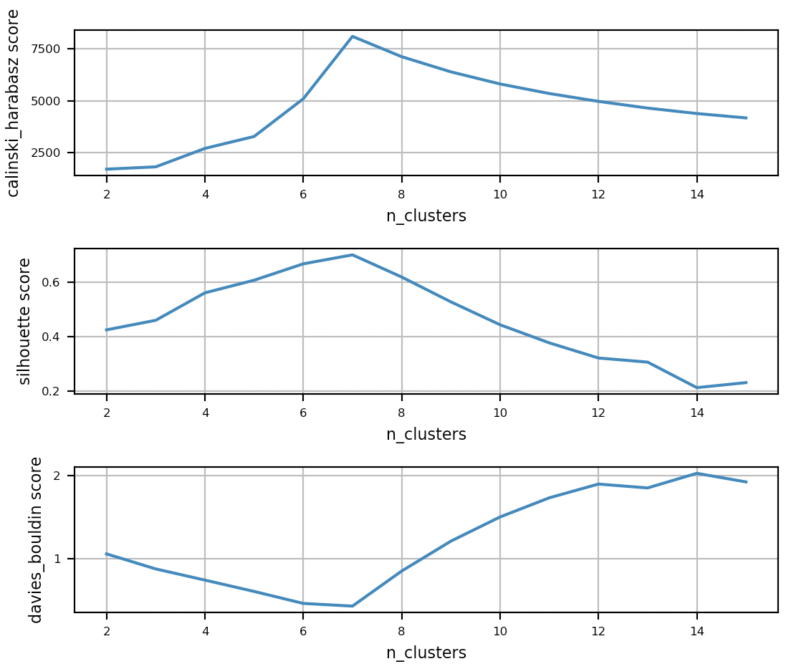
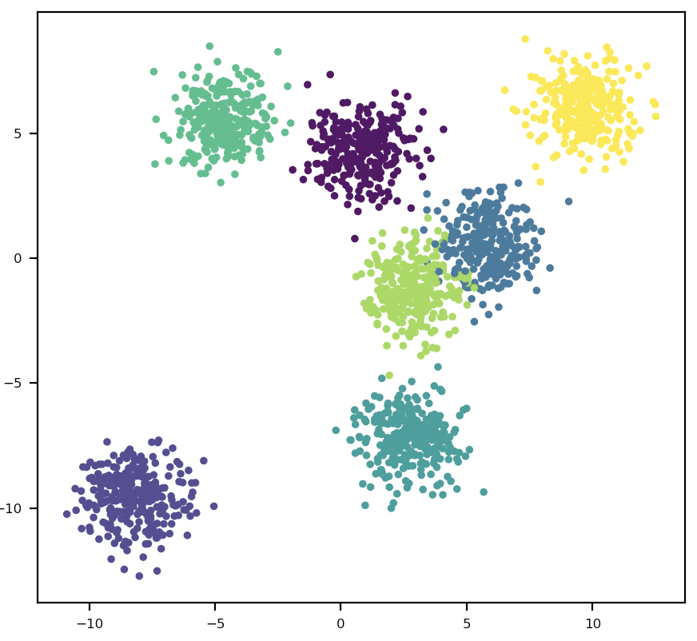
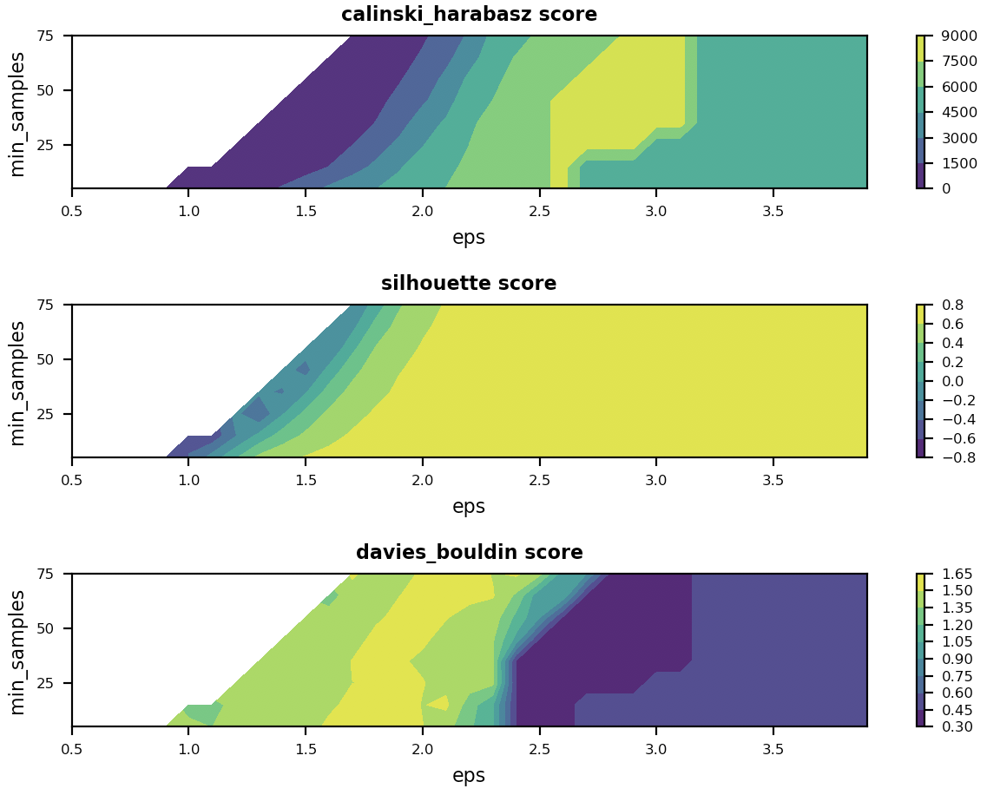
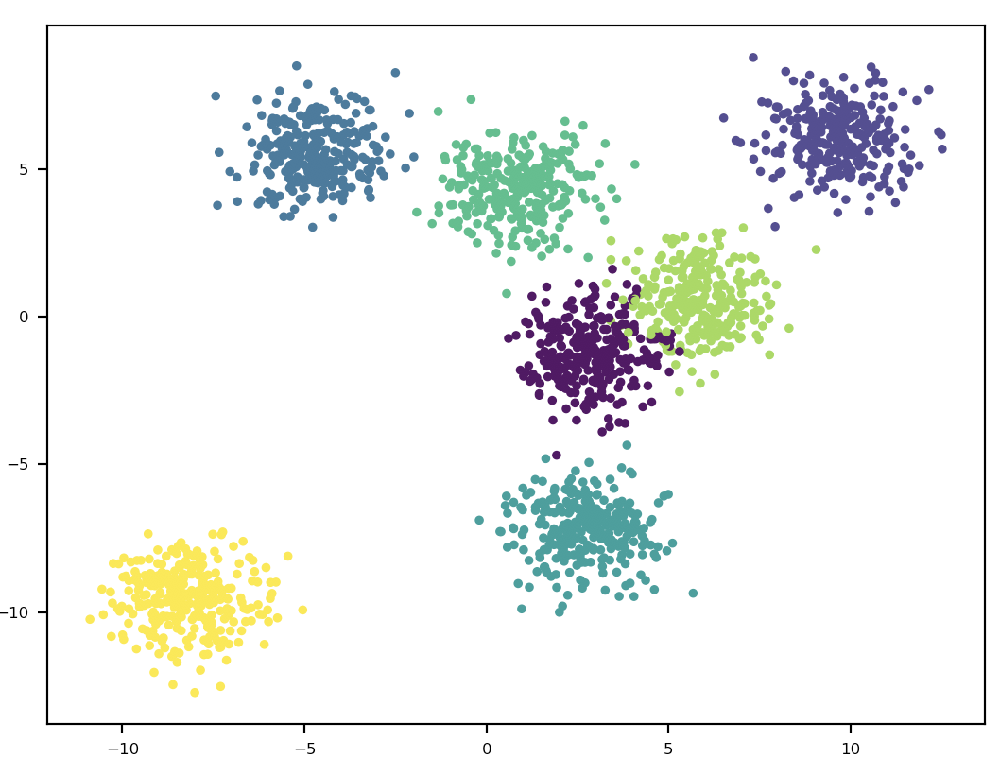

# clustering_algorithm
聚类算法（建议使用Typora打开该文档）


#### 1. 无监督聚类（Unsupervised Clustering）

*<u>**1.1 K-Means Clustering**</u>*

算法初始化KMeansClustering对象需要设置以下参数：

```
n_clusters 		# 聚类簇数
init_method  	# 簇参数初始化方法，默认为'k-means++'
max_iter		# 最大迭代次数，默认为300
tol				# 迭代容差，默认为1e-4
random_state	# 随机初始状态标记参数，默认为0
**kwargs		# 参见sklearn.cluster.KMEANS其他关键字
```

```python
clstr = KMeansClustering()
_ = clstr.init_clstr(n_clusters = 7)  # n_clusters = 7
```

使用fit方法对样本X进行聚类，获得模型聚类标签：

```python
y_pred = clstr.fit(data, show = False)
```

使用optim_params_search函数搜索最优聚类参数n_clusters：

```python
records = optim_params_search(data, n_clusters_list, eval_method = 'calinski_harabasz')
```

参数搜索结果如下：



可见最优n_clusters = 7，相应的聚类效果为：




*<u>**1.2 DBSCAN Clustering**</u>*

算法初始化DBSCANClustering对象需要设置以下参数：

```
eps 			# 同一簇中两个样本间的最大距离
min_samples		# 一个簇中样本数目下限
**kwargs		# 参见sklearn.cluster.DBSCAN其他关键字
```

```python
dc = DBSCANClustering()
_ = dc.init_clstr(eps = 2.7, min_samples = 50)  # eps = 2.7, min_samples = 50
```

使用fit方法对样本X进行聚类，获得模型聚类标签：

```python
y_pred = dc.fit(data, show = False)
```

使用optim_params_search函数搜索最优聚类参数eps、min_samples：

```python
records = optim_params_search(data, eps_list, min_samples_list, eval_method = 'calinski_harabasz')
```

参数搜索结果如下：



可见最优参数eps = 2.7、min_samples = 50，相应的聚类效果如下：




#### 2. 有监督聚类（Supervised Clustering）


#### 3. 聚类效果评测（Clustering Effect Evaluation)

聚类结果（X对应标签Y）可使用CH分数Calinski Harabasz Score、轮廓系数Silhouette Coefficient和戴维森堡丁指数Davies Bouldin Index进行评价，三种分数的公式和特点如下：

<u>***3.1 Calinski Harabasz Score***</u>：
$$
s(k)=\frac{{\rm{Tr}}(B_k)}{{\rm{Tr}}(W_k)} \times \frac{N-k}{k-1}
$$
其中，$B_k$为簇间色散平均值（between-clusters dispersion mean），$W_k$为群内色散度（within-cluster dispersion），计算公式如下：
$$
B_k = \sum_q n_q(c_q - c)(c_q - c)^T
$$

$$
W_k = \sum_{q=1}^{k} \sum_{x \in C_q}(x - c_q)(x - c_q)^T
$$

在聚类过程中，类别内部数据的协方差越小越好，类别之间的协方差越大越好，所以CH分数越高，聚类效果越好。

**<u>优点</u>**：

1. 当 cluster （簇）密集且分离较好时，分数更高，这与一个标准的 cluster（簇）有关；
2. 分数计算快；

<u>**缺点**</u>：

1. 凸簇的CH分数通常高于其他类型的簇（例如通过 DBSCAN 获得的基于密度的簇）；


<u>***3.2 Silhouette Coefficient***</u>：

轮廓系数SC结合内聚度和分离度两种因素，用来在相同原始数据的基础上用来评价不同算法、或者算法不同运行方式对聚类结果所产生的影响。
$$
sc(i) = \frac{b(i) - a(i)}{\max\{a(i), b(i)\}}
$$
即：
$$
\begin{equation}
sc(i) = \left\{
\begin{aligned}
&1 - \frac{a(i)}{b(i)}, \quad a(i) < b(i) \\
&0, \quad a(i) = b(i) \\
&\frac{b(i)}{a(i)} - 1, \quad a(i) > b(i) \\
\end{aligned}
\right.
\end{equation}
$$

- 计算样本i到同簇其他样本的平均距离（凝聚度）$a(i)$，$a(i)$越小，说明样本$i$越应该被聚类到该簇。将$a(i)$成为样本$i$的簇内不相似度;

- 计算样本$i$到其他某簇$C_j$的所有样本的平均距离$b_{ij}$，称为样本$i$与簇$C_j$的不相似度。定义为样本$i$的簇间不相似度（分离度）：
  $$
  b_i = \min \{b_{i1},b_{i2},...,b_{ik}\}；
  $$
  
- $sc(i)$接近1，则说明样本$i$聚类合理；$sc(i)$接近-1，则说明样本$i$更应该分类到另外的簇；若$sc(i)$近似为0，则说明样本$i$在两个簇的边界上；


<u>***3.3 Davies Bouldin Index***</u>：

戴维森堡丁指数，又称为分类适确性指标。假设我们有$m$个时间序列，这些时间序列聚类为$n$个簇。$m$个时间序列设为输入矩阵$X$，$n$个簇类设为$N$作为参数传入算法。使用下列公式进行计算：
$$
DBI=\frac{1}{N} \sum_{i=1}^{N} \max\limits_{i \ne j}(\frac{\overline S_i + \overline S_j}{\|A_i - A_j\|_2})
$$
其中，$N$为聚类簇个数，$S_i$计算的是类内数据到簇质心的平均距离，代表了簇类$i$中各样本的分散程度：
$$
S_i = (\frac{1}{T_i} \sum_{j = 1}^{T_i} |X_j - A_i|^p)^{1/p}
$$
$X_j$代表了簇$i$中的第$j$个样本，$A_i$表示簇$i$的质心，$T_i$是簇$i$中样本点个数，$p$在通常情况下取2，表示欧式距离（高维情况下使用其他距离度量方式替代）。

若算法生成的聚类结果朝着类内距离最小（簇内相似度最大）、类间距离最大（簇间差异性最大），则DBI指数值越小，分类效果越好。

<u>**缺点**</u>：

1. 因使用欧式距离所以对环状数据评测效果很差；